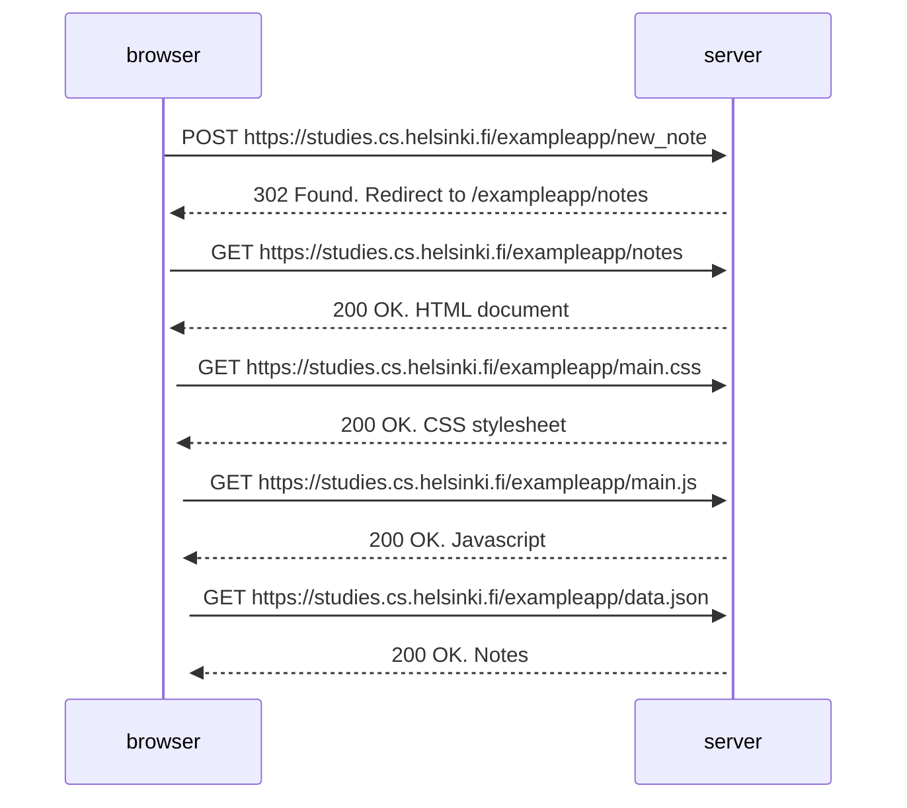

```mermaid
sequenceDiagram
    participant browser
    participant server

    %% When the button on the form is clicked, the browser will send the user input to the server.
    %% The first request is the form submit event.
    browser->>+server: POST https://studies.cs.helsinki.fi/exampleapp/new_note
    
    %% The server asks the browser to do a new HTTP GET request to the address defined in the header's Location - the address notes.
    server-->>+browser: 302 Found. Redirect to /exampleapp/notes

    %% So, the browser reloads the Notes page.
    browser->>+server: GET https://studies.cs.helsinki.fi/exampleapp/notes
    server-->>+browser: 200 OK. HTML document
    %% The reload causes three more HTTP requests: fetching the style sheet (main.css)
    browser->>+server: GET https://studies.cs.helsinki.fi/exampleapp/main.css
    server-->>+browser: 200 OK. CSS stylesheet
    %%  the JavaScript code (main.js),
    browser->>+server: GET https://studies.cs.helsinki.fi/exampleapp/main.js
    server-->>+browser: 200 OK. Javascript
    %% and the raw data of the notes (data.json).
    browser->>+server: GET https://studies.cs.helsinki.fi/exampleapp/data.json
    server-->>+browser: 200 OK. Notes
```
