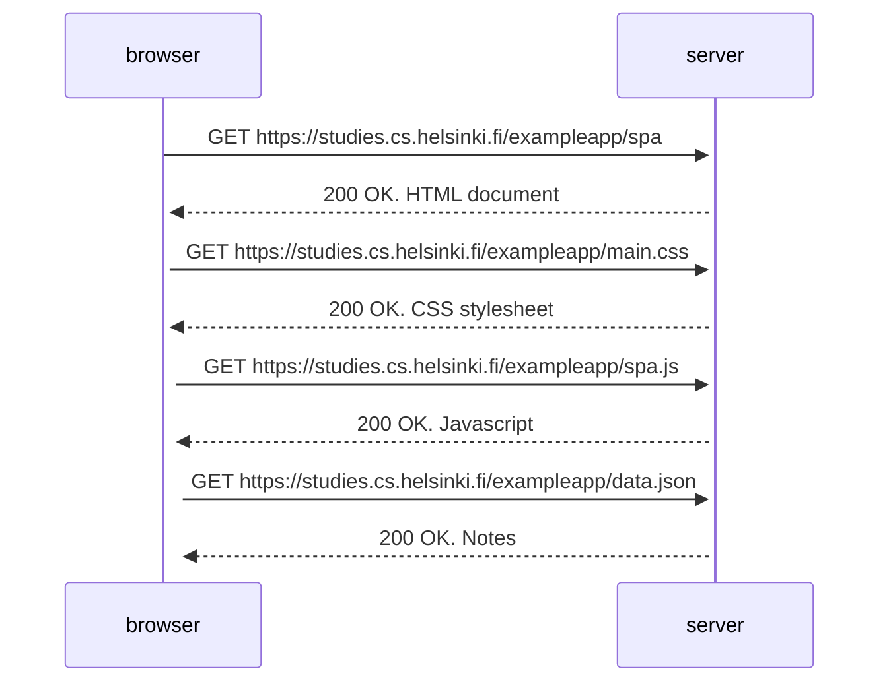

```mermaid
sequenceDiagram
    participant browser
    participant server

    %% User goes to spa page. Browser fetches the HTML
    browser->>+server: GET https://studies.cs.helsinki.fi/exampleapp/spa
    %% Server sends the document
    server-->>+browser: 200 OK. HTML document

    %% Browser sees the meta tag linking to CSS and fetches it
    browser->>+server: GET https://studies.cs.helsinki.fi/exampleapp/main.css
    %% Server sends the stylesheet
    server-->>+browser: 200 OK. CSS stylesheet

    %%  Browser sees the script tag and fetches it
    browser->>+server: GET https://studies.cs.helsinki.fi/exampleapp/spa.js
    %% Servers sends the Javascript
    server-->>+browser: 200 OK. Javascript

    %% Script tells the browser to fetch the notes
    browser->>+server: GET https://studies.cs.helsinki.fi/exampleapp/data.json
    %% Servers sends the notes json
    server-->>+browser: 200 OK. Notes
```
