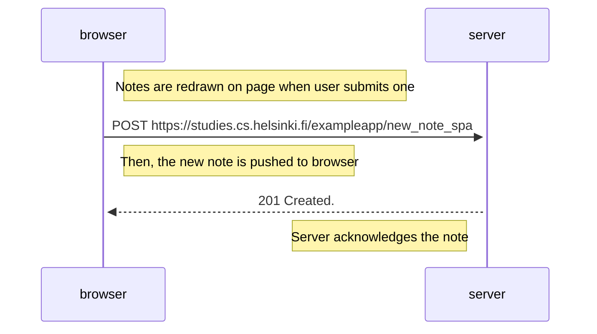

```mermaid
sequenceDiagram
    participant browser
    participant server

    %% User submits the note
    Note right of browser: Notes are redrawn on page when user submits one
    browser->>+server: POST https://studies.cs.helsinki.fi/exampleapp/new_note_spa
    Note right of browser: Then, the new note is pushed to browser
    server-->>+browser: 201 Created.
    Note left of server: Server acknowledges the note
```
